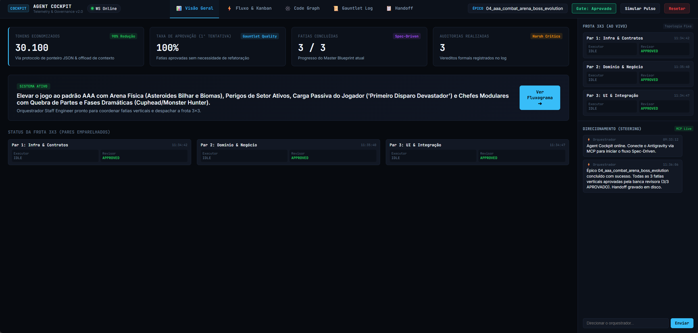
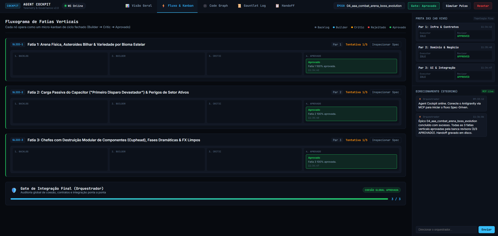
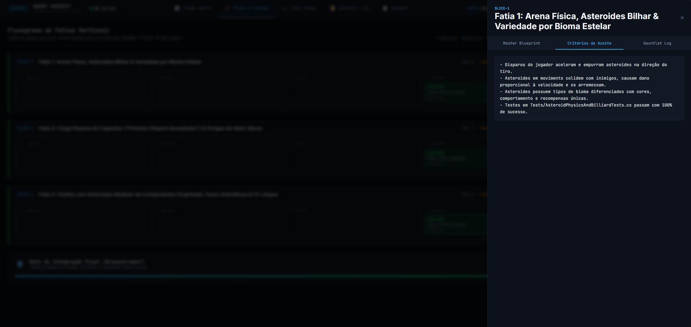
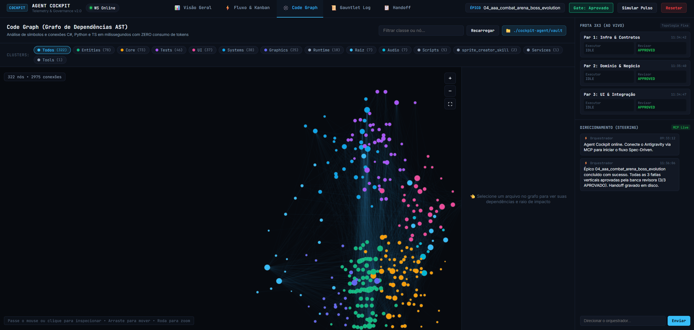
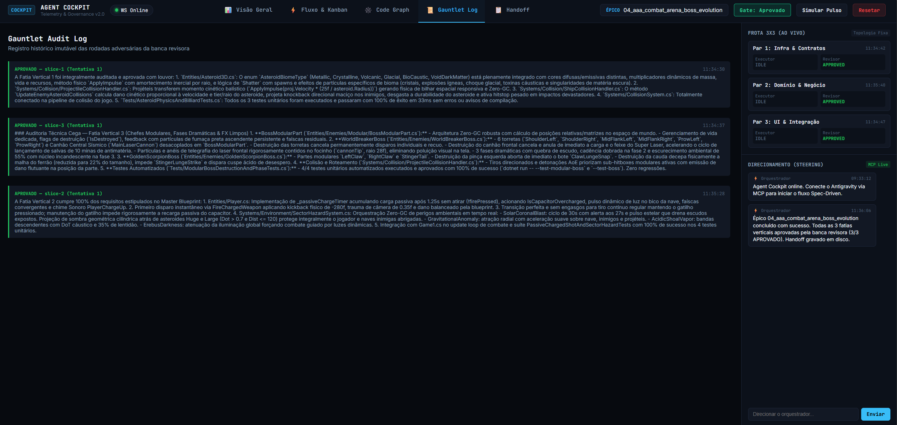
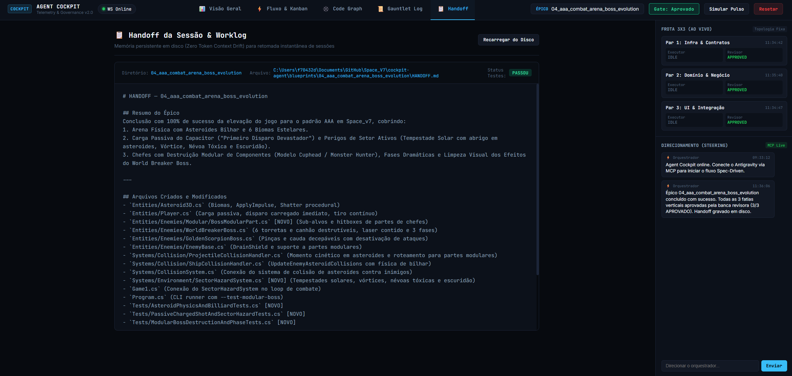

<div align="center">

# Agent Cockpit 🎛️

**Visual Multi-Agent Telemetry, AST Dependency Graph & Governance Hub for AI Coding Fleets**

[](LICENSE)
[](https://python.org)
[](https://fastapi.tiangolo.com)
[]()
[](https://obsidian.md)
[]()
[]()
[]()

</div>

---

**Agent Cockpit** is a local, offline command center and telemetry server built for spec-driven multi-agent AI development. It bridges MCP-compatible AI orchestrators ([Google Antigravity](https://deepmind.google/antigravity), Claude Desktop) with a real-time reactive dashboard showing agent fleet status, vertical slice kanbans, adversarial review logs, session handoffs, and an interactive AST dependency graph integrated with Obsidian.

All structural codebase intelligence, graph mapping, and test distillation happen **100% locally with zero LLM token consumption**.

```
┌────────────────────────────────────────────────────────────────────────┐
│                        AI FLEET & ORCHESTRATOR                         │
│   Par 1: Infra & Contratos  │  Par 2: Domínio & Negócio  │ Par 3: UI   │
│   (Executor + Revisor)      │  (Executor + Revisor)      │ (Exec+Rev)  │
└───────────────────────────────────┬────────────────────────────────────┘
                                    │ stdio (JSON-RPC 2.0)
                                    ▼
┌────────────────────────────────────────────────────────────────────────┐
│                         AGENT COCKPIT SERVER                           │
│  ┌─────────────────────────┐  ┌─────────────────────────────────────┐  │
│  │   MCP Server (stdio)    │  │        FastAPI & WebSockets         │  │
│  │  14 Specialized Tools   │  │   REST API + Real-time Push (/ws)   │  │
│  └───────────┬─────────────┘  └──────────────────┬──────────────────┘  │
│              │                                   │                     │
│  ┌───────────▼─────────────┐  ┌──────────────────▼──────────────────┐  │
│  │ State Machine & Metrics │  │ Code Graph & Obsidian Vault Sync    │  │
│  │   (Atomic JSON Store)   │  │ AST Parser • Wikilinks • Notes DB   │  │
│  └─────────────────────────┘  └─────────────────────────────────────┘  │
└───────────────────────────────────┬────────────────────────────────────┘
                                    │
                                    ▼
┌────────────────────────────────────────────────────────────────────────┐
│                  LOCAL DIRECTORY: ./cockpit-agent/                     │
│   ├── blueprints/           # Master Blueprints, Locks & Handoffs      │
│   └── vault/                # Obsidian-compatible Markdown Knowledge   │
└────────────────────────────────────────────────────────────────────────┘
```

---

## 📸 Interface Showcase

### 1. Visão Geral (Overview Dashboard & Live Steering)
A central control room displaying real-time productivity KPIs, fleet execution states, active epic banners, and a bidirectional human-in-the-loop steering chat.



- **KPI Grid**: Track tokens saved via AST indexing, first-pass review rate, vertical slices completed, and MCP/WebSocket heartbeat.
- **Frota 3x3 (Ao Vivo)**: Real-time telemetry for all 3 executor/reviewer pairs (Infra, Domain, UI).
- **Direcionamento (Steering)**: Chat directly with the AI orchestrator to inject human instructions or course corrections mid-flight without context loss.

---

### 2. Fluxograma de Fatias Verticais (Flow & Kanban)
Pipeline visualizer where vertical slices operate as autonomous micro-kanbans (`Backlog → Builder → Critic → Approved`) ending in a unified release integration gate.



- **Micro-Kanban por Fatia**: Visual feedback as cards shift dynamically when agents commit code or submit PRs.
- **Gate de Integração Final**: Automatic global cohesion verification and regression test validation before final release sign-off.

---

### 3. Drawer de Inspeção de Fatias (Slice Detail & Acceptance Criteria)
Click any slice in the pipeline to open the lateral inspection drawer containing the full vertical specification, checklist, and audit history.



- **Critérios de Aceite**: Markdown checklists extracted straight from the `MASTER_BLUEPRINT.md`.
- **Master Blueprint Viewer**: Full slice context isolated from the rest of the project.
- **Log do Gauntlet Integrado**: View historical passes, rejections, and test assertions for that specific slice.

---

### 4. Grafo de Dependências AST & Constelação Obsidian (Code Graph)
Interactive 2D constellation canvas powered by AST regex parsing. Zero tokens, zero external API calls.



- **Constelação Estelar**: Nodes sized proportionally to connectivity (degree) and color-coded by directory clusters (`Entities`, `Core`, `Systems`, `UI`, `Tests`, etc.).
- **Filtros de Cluster**: Instant filtering buttons at the top to isolate subsystems with a single click.
- **Navegação Inteligente**: Clique em um nó para focar e abrir o drawer; clique no fundo ou selecione um filtro para desfocar; clique duplo no nó para desselecionar.
- **Editor de Notas Obsidian**: Drawer lateral que exibe os símbolos (classes, métodos, interfaces) e permite editar anotações Markdown persistidas diretamente no Vault.

---

### 5. Gauntlet Audit Log (Banca Revisora Adversária)
Immutable historical record of every adversarial review round between Builders and Harsh Critics.



- **Auditoria Cega**: Critics evaluate implementations against acceptance criteria without knowing internal builder shortcuts.
- **Registro Detalhado**: Captures passed unit tests, coverage requirements, and constructive feedback on failure loops.

---

### 6. Handoff da Sessão & Worklog (Zero Token Context Drift)
Persistent on-disk session memory located at `./cockpit-agent/blueprints/{epic}/HANDOFF.md` allowing instantaneous session resumption with zero token bloat.



- **Resumo do Épico**: High-level overview of delivered capabilities.
- **Arquivos Criados e Modificados**: Complete inventory of touched files and tests.
- **Status dos Testes & Passos Futuros**: Ready-to-use briefing for the next developer or agent session.

---

## 📂 Estrutura Padronizada `./cockpit-agent/`

Para manter o repositório principal limpo e garantir compatibilidade nativa com ferramentas como [Obsidian](https://obsidian.md), o Agent Cockpit padroniza todos os artefatos de governança em uma pasta raiz unificada:

```
<raiz-do-seu-projeto>/
└── cockpit-agent/
    ├── blueprints/
    │   └── {NN_nome_do_epico}/
    │       ├── MASTER_BLUEPRINT.md    # Especificação pragmática vertical
    │       ├── blueprint.lock.json    # Contrato imutável de validação
    │       └── HANDOFF.md             # Memória persistente e log de trabalho
    │
    └── vault/                         # Obsidian Vault gerado via AST (Zero-Token)
        ├── .obsidian/
        │   └── app.json               # Configurações do Obsidian (Wikilinks ativos)
        ├── INDEX.md                   # Índice mestre categorizado por clusters
        └── {caminho_do_arquivo}.md    # Nota de cada arquivo de código com wikilinks
```

### Notas do Obsidian com Preservação de Anotações
Cada arquivo de código gera uma nota correspondente no Vault contendo:
- **YAML Frontmatter**: `type: code_node`, `cluster`, `file_path`, `degree`, `dependencies`, `symbols`.
- **Wikilinks Bidirecionais**: Links como `[[Entities/Player.cs]]` navegáveis tanto pelo Cockpit quanto pelo Obsidian.
- **Bloco Seguro de Anotações**:
  ```markdown
  <!-- COCKPIT_NOTES_START -->
  ### Anotações da Arquitetura
  - O capacitor passivo foi adicionado aqui para carregar o primeiro tiro.
  <!-- COCKPIT_NOTES_END -->
  ```
  Quaisquer anotações manuais ou notas de agentes escritas dentro deste bloco são **estritamente preservadas** mesmo após sucessivas re-sincronizações do grafo AST!

---

## 🛠️ Ferramentas MCP (Protocolo JSON-RPC 2.0)

O servidor MCP stdio expõe 14 ferramentas de alta precisão para o agente orquestrador:

| Ferramenta | Descrição |
| :--- | :--- |
| `sync_blueprint` | Inicializa o épico e as fatias verticais, gerando o `blueprint.lock.json` em `./cockpit-agent/blueprints/`. |
| `update_agent_pulse` | Envia telemetria em tempo real dos pares 3x3 e movimenta cards no Kanban visual. |
| `log_critique_verdict` | Registra aprovações ou reprovações detalhadas no Gauntlet Audit Log. |
| `fetch_user_steering` | Lê instruções e feedbacks humanos enviados pelo chat da interface web. |
| `post_orchestrator_message` | Envia mensagens de progresso do orquestrador para o chat do Cockpit. |
| `get_cockpit_state` | Retorna o snapshot JSON completo do estado de governança atual. |
| `run_project_tests` | Executa a suíte de testes (`dotnet test`, `pytest`, `npm test`) e destila apenas falhas e stack traces (95% menos tokens). |
| `get_slice_failure_report` | Obtém histórico destilado de falhas de uma fatia específica. |
| `analyze_codebase_graph` | Executa varredura AST estática e retorna o grafo de dependências sem gastar tokens. |
| `query_symbol_impact` | Retorna a zona de impacto (blast radius) de um símbolo ou arquivo modificado. |
| `generate_handoff` | Escreve o `HANDOFF.md` padronizado em disco para encerramento ou continuidade de sessão. |
| `read_last_handoff` | Lê o último handoff registrado para retomar o projeto com zero drift de contexto. |
| `get_slice_spec` | Retorna apenas a especificação isolada de uma fatia vertical (economia de 80% de tokens para os subagentes). |
| `check_human_gate` | Verifica se o operador humano aprovou o gate de liberação/integração no painel. |

---

## 🌐 Endpoints da API REST & WebSockets

O backend FastAPI opera na porta `8765` por padrão:

| Método | Endpoint | Parâmetros | Descrição |
| :--- | :--- | :--- | :--- |
| `GET` | `/api/state` | — | Snapshot completo do estado atual da máquina de estados. |
| `GET` | `/api/metrics` | — | Métricas de produtividade (tokens economizados, aprovações, fatias). |
| `GET` | `/api/graph` | `root` (opcional) | Grafo AST de dependências, clusters, graus e símbolos do projeto. |
| `GET` | `/api/vault/note` | `file`, `root` | Retorna o conteúdo Markdown da nota associada a um arquivo no Vault. |
| `POST` | `/api/vault/note` | JSON: `{file, content, root}` | Salva edições na nota Markdown preservando o bloco de anotações. |
| `POST` | `/api/vault/sync` | JSON: `{root}` | Força a re-sincronização do Obsidian Vault a partir da árvore AST. |
| `GET` | `/api/handoff` | `root` (opcional) | Carrega o arquivo `HANDOFF.md` mais recente persistido em disco. |
| `POST` | `/api/project_root` | JSON: `{project_root}` | Atualiza o diretório raiz do projeto ativo em tempo de execução. |
| `POST` | `/api/steering` | JSON: `{message}` | Enfileira um comando humano para consumo do orquestrador via MCP. |
| `POST` | `/api/gates/approve` | JSON: `{gate_id}` | Aprova manualmente um gate de qualidade ou integração. |
| `POST` | `/api/reset` | — | Reinicializa a máquina de estados para o estado inicial. |
| `GET` | `/api/health` | — | Health check retornando `{"status": "healthy"}`. |
| `WS` | `/ws` | — | Canal WebSocket bidirecional para atualizações reativas instantâneas. |

---

## 🚀 Instalação e Inicialização

### Pré-requisitos
- **Python 3.9+** instalado ([python.org](https://python.org))
- Cliente MCP compatível: **Google Antigravity** ou **Claude Desktop**

### 1. Instalação Automática (1-Clique)

**No Windows:**
```cmd
install.bat
```

**No macOS / Linux:**
```bash
chmod +x install.sh
./install.sh
```

O instalador automático:
1. Valida o ambiente Python e instala as dependências (`fastapi`, `uvicorn`, `websockets`, `pydantic`).
2. Configura automaticamente o servidor MCP no seu cliente de IA preferido.
3. Instala as skills empacotadas (`cockpit`, `spec-orchestrator`, `gauntlet-loop`).

### 2. Inicializando o Cockpit

**No Windows:**
```cmd
start_cockpit.bat
```

**Via Terminal (Qualquer Plataforma):**
```bash
python run_cockpit.py
```

Acesse o painel no seu navegador: **`http://localhost:8765`**.

---

## ⚙️ Configuração Manual do MCP

Se preferir configurar o MCP manualmente no arquivo de configuração do seu cliente (`~/.gemini/config/mcp_config.json` ou Claude Desktop `claude_desktop_config.json`):

```json
{
  "mcpServers": {
    "agent-cockpit": {
      "command": "python",
      "args": [
        "C:/caminho/absoluto/para/agent-cockpit/server/mcp_server.py"
      ]
    }
  }
}
```

---

## 💡 Como Usar com Seu Agente de IA

Com o Cockpit em execução, abra seu assistente de IA e execute:

```text
Ative a skill /cockpit e orquestre as fatias deste projeto usando /spec-orchestrator
```

O orquestrador executará o ciclo de voo completo:
1. Escaneia o código via `analyze_codebase_graph` e gera a estrutura `./cockpit-agent/vault/`.
2. Cria o `MASTER_BLUEPRINT.md` e registra no Cockpit via `sync_blueprint`.
3. Despacha os 3 pares simultâneos da Frota 3x3, enviando telemetria em tempo real via `update_agent_pulse`.
4. Executa os testes automatizados com `run_project_tests` e registra as rodadas adversárias via `log_critique_verdict`.
5. Emite o `HANDOFF.md` final via `generate_handoff` para garantir retomada perfeita.

---

## 🧪 Testes Automatizados

Para rodar a suíte de testes de integração e validação do servidor:

```bash
python test_cockpit.py
```

Valida o handshake JSON-RPC do MCP, atomicidade da máquina de estados, endpoints REST e canais WebSocket.

---

## 📄 Licença

Distribuído sob a licença MIT. Veja [LICENSE](LICENSE) para mais detalhes.
