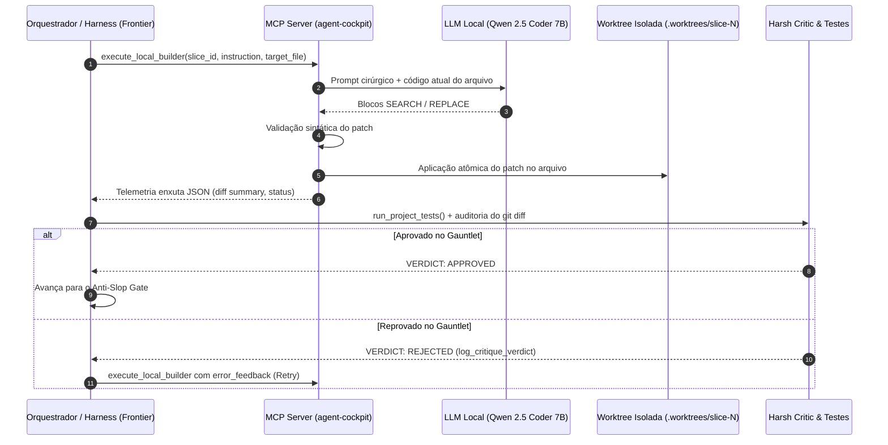

# Arquitetura de Implementação: Local Worker Delegation via MCP (Agent Cockpit)

## 1. Visão Geral & Objetivo

Implementar no servidor MCP `agent-cockpit` o padrão **Local Worker / Frontier Critic** (ou *LLM-as-a-Tool*).
O objetivo é delegar a digitação mecânica de código para um modelo de linguagem local (ex: **Qwen 2.5 Coder 7B Instruct** rodando na GPU local via Ollama ou llama.cpp) através de uma ferramenta MCP nativa, reservando o harness da nuvem (modelo frontier de alta capacidade) exclusivamente para:
1. **Arquitetura e decomposição de fatias verticais** (`spec-orchestrator`);
2. **Especificação cirúrgica de tarefas** (`MASTER_BLUEPRINT.md`);
3. **Auditoria rigorosa e portões de qualidade** (`gauntlet-loop` / *Harsh Critic*).

---

## 2. Diagrama de Fluxo Operacional



---

## 3. Diretrizes de Engenharia (Sem Gambiarras)

### 3.1. Provedor de Inferência Local
- **Runtime Padrão:** Ollama ou `llama-server` (compatível com a API OpenAI em `http://127.0.0.1:11434/v1`).
- **Modelo Recomendado:** `qwen2.5-coder:7b-instruct-q4_k_m` (ocupa ~5.2 GB de VRAM, deixando >2 GB livres para KV Cache na GPU de 8GB).
- **Hiperparâmetros:** `temperature: 0.1`, `top_p: 0.95`, `stream: false`.

### 3.2. Mecanismo de Patching Cirúrgico (Search/Replace Blocks)
Para evitar que modelos locais de 7B alucinem tentando reescrever arquivos completos de centenas de linhas, o MCP obriga o modelo a responder estritamente no padrão de blocos `SEARCH/REPLACE` (estilo *Aider*):

```text
<<<<<<< SEARCH
código original a ser substituído
=======
novo código implementado
>>>>>>>
```

#### Regras de Validação do Patch Engine:
1. **Exatidão de Match:** O conteúdo dentro de `SEARCH` deve existir exatamente uma vez no arquivo de destino.
2. **Atomicidade:** Se houver múltiplos blocos no mesmo arquivo e um falhar, nenhuma alteração é persistida no disco.
3. **Isolamento de Caminho:** O `target_file` é validado para garantir que está restrito à pasta `.worktrees/{slice_id}/`, impedindo vulnerabilidades de *Directory Traversal*.

---

## 4. Assinatura da Nova Ferramenta MCP

Adicionar ao servidor `agent-cockpit` (em `server/mcp_server.py` ou módulo correspondente) a seguinte tool:

```python
@mcp.tool()
def execute_local_builder(
    slice_id: str,
    instruction: str,
    target_file: str,
    context_files: list[str] | None = None,
    error_feedback: str | None = None
) -> dict:
    """
    Delega a implementação física de código para o LLM local dentro da worktree isolada da fatia.
    
    Args:
        slice_id: Identificador da fatia (ex: 'slice-1'), mapeada em .worktrees/slice-1.
        instruction: Descrição direta da alteração requerida.
        target_file: Caminho relativo do arquivo que sofrerá alteração dentro da worktree.
        context_files: Lista opcional de arquivos adicionais para o modelo ler como contexto (somente leitura).
        error_feedback: Opcional. Mensagem de erro de testes ou apontamentos do Harsh Critic para ciclo de correção.
    
    Returns:
        JSON com status da execução, resumo do diff e telemetria de consumo.
    """
```

### Contrato de Retorno (Zero-Fluff JSON)
O retorno não envia o código-fonte gerado para a janela de contexto do harness, preservando tokens:

```json
{
  "status": "DELIVERED",
  "slice_id": "slice-1",
  "target_file": "src/components/Button.tsx",
  "hunks_applied": 1,
  "diff_summary": "+15 -3 lines",
  "execution_time_ms": 2840,
  "local_tokens_generated": 142
}
```

---

## 5. Integração com o Gauntlet Loop do Cockpit

### 5.1. Ciclo de Execução TDD (Etapa 4 do Cockpit)
1. **Fase Red (TDD Iron Law):**
   - O Orquestrador chama `execute_local_builder` para criar/modificar o arquivo de teste unitário conforme o contrato da Blueprint.
   - O Orquestrador executa `run_project_tests(tdd_mode="verify_red")` para certificar que o teste falhou pelo motivo certo.
2. **Fase Green (Implementação):**
   - O Orquestrador chama `execute_local_builder` passando a instrução de implementação e o arquivo de produção.
   - O Orquestrador executa `run_project_tests(tdd_mode="verify_green")`.
3. **Auditoria Cega (Gauntlet Critic):**
   - O subagente revisor inspeciona o `git diff` real e o resultado dos testes.
   - Registra o veredito via `log_critique_verdict`.

### 5.2. Protocolo de Fallback & Circuit Breaker
- Limite de tentativas locais por fatia: **2 iterações**.
- Se após 2 tentativas o modelo local continuar gerando código rejeitado pelo Gauntlet ou quebrando os testes:
  1. O MCP retorna:
     ```json
     {
       "status": "ESCALATION_REQUIRED",
       "slice_id": "slice-1",
       "reason": "local_worker_threshold_exceeded",
       "last_error": "AssertionError: expected status 200, got 500"
     }
     ```
  2. O Orquestrador do Harness detecta o escalonamento e despacha um subagente de nuvem (`invoke_subagent`) com o modelo frontier para resolver o caso complexo.

---

## 6. Checklist de Implementação para o Agente Executor

- [ ] **Módulo `server/workers/local_llm_client.py`:**
  - Cliente HTTP usando `httpx` para chamada assíncrona ao Ollama (`/v1/chat/completions`).
  - Healthcheck para checar se o Ollama está online antes de processar.
  - Formatação do System Prompt estrito com exemplos de blocos `SEARCH/REPLACE`.
- [ ] **Módulo `server/workers/patch_engine.py`:**
  - Parser de blocos de substituição.
  - Verificação de caminhos seguros contra *Path Traversal*.
  - Aplicação atômica e rollback em caso de falha de match.
- [ ] **Módulo `server/tools/local_builder_tool.py`:**
  - Integração da tool `execute_local_builder` ao servidor FastMCP.
  - Registro de telemetria no dashboard (`update_agent_pulse`).
- [x] **Testes de Regressão (`tests/test_local_builder.py`):**
  - Testes unitários do `patch_engine` (match exato, múltiplos blocos, indentação preservada, erro de match).
  - Testes de integração com mock do endpoint Ollama.

---

## 7. Matriz de Especialização & Delimitação de Escopo (Local vs Frontier)

Com base em benchmarks empíricos reais na GPU AMD Radeon RX 6600 (8 GB VRAM) com DeepSeek-Coder-V2 16B MoE Q3_K_M (~25 tks/s), a divisão de trabalho entre modelo local e modelo de nuvem é estritamente delimitada:

| Camada / Tipo de Tarefa | Executor Designado | Justificativa Técnica |
| :--- | :--- | :--- |
| **Funções Auxiliares & Utilitários** (`utils/`, `helpers/`, `formatters/`, `validators/`) | **Local Worker (DeepSeek 16B)** | Tarefas atômicas (< 50 linhas), puras, sem estado complexo. Excelente taxa de acerto de primeira e custo $0.00. |
| **Transformação de Dados, Parsing e Regex** | **Local Worker (DeepSeek 16B)** | Algoritmos isolados e mecânicos (ex: validação CPF/Email, parse JSON/CSV, slugify). |
| **Scaffold de Tipos, DTOs e Schemas** | **Local Worker (DeepSeek 16B)** | Estruturas de dados, classes de contrato e interfaces bem definidas. |
| **Testes Unitários de Funções Auxiliares** | **Local Worker (DeepSeek 16B)** | Testes simples de entrada/saída determinística com unittest/jest. |
| **Design System & Estilização (CSS / SCSS / Tailwind)** | **Nuvem (Frontier)** | Requer sensibilidade estética, proporção áurea, glassmorphism e responsividade. Gerado em 2s pela nuvem (`delegate_styles_to_cloud: true`). |
| **Arquitetura de Telas, HTML Semântico & Layouts** | **Nuvem (Frontier)** | Estruturas de alta interdependência visual e hierarquia de componentes. |
| **Orquestração, Domain Core & Resolução de Falhas** | **Nuvem (Frontier)** | Raciocínio profundo, governança multiagente e auditoria adversária. |

