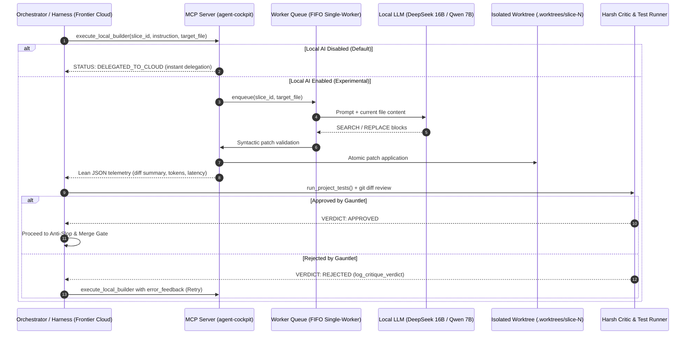

# Implementation Architecture: Local Worker Delegation via MCP (Agent Cockpit)

## 1. Overview & Objective

Implement the **Local Worker / Frontier Critic** pattern (or *LLM-as-a-Tool*) within the `agent-cockpit` MCP server.
The primary goal is delegating deterministic, mechanical code generation to a local language model (e.g., **DeepSeek-Coder-V2 16B MoE** or **Qwen 2.5 Coder 7B/14B** running on consumer hardware via Ollama or llama.cpp) via a native MCP tool, while reserving the cloud frontier harness (e.g., Claude 3.7 Sonnet, Gemini 2.5 Pro, GPT-4o) exclusively for:
1. **High-level architecture and vertical slice decomposition** (`spec-orchestrator`);
2. **Surgical blueprint specification** (`MASTER_BLUEPRINT.md`);
3. **Adversarial auditing, test verification, and quality gates** (`gauntlet-loop` / *Harsh Critic*).

> [!IMPORTANT]
> **Status: Experimental (Disabled by Default)**
> Extensive empirical benchmarks demonstrate that local models on 8GB VRAM consumer GPUs excel at focused auxiliary functions, schema scaffolding, and atomic unit tests, but struggle when tasked with full layout generation, CSS design systems, or cross-component state.
> Consequently, **Local AI is disabled by default** (`enable_local_ai: false`). When disabled, all tasks delegate directly to cloud frontier models with zero friction. Enable only when offloading auxiliary mechanical routines.

---

## 2. Operational Sequence Diagram



---

## 3. Engineering Guidelines (Zero-Workarounds Principle)

### 3.1. Local Inference Runtime
- **Default Runtime:** Ollama or `llama-server` (compatible with the OpenAI-compatible API at `http://127.0.0.1:11434/v1`).
- **Recommended Models:**
  - `deepseek-coder-v2:16b-q3_k_m` (quantized MoE, ~8.1 GB VRAM/RAM footprint, achieves ~25-27 tks/s with CPU offload tuning).
  - `qwen2.5-coder:7b-instruct-q4_k_m` (pure GPU footprint ~5.2 GB VRAM, ultra-fast latency).
- **Hyperparameters:** `temperature: 0.1`, `top_p: 0.95`, `stream: false`.

### 3.2. Surgical Patching Engine (Search/Replace Blocks)
To prevent smaller local models from hallucinating when rewriting whole files, the MCP server enforces strict Aider-style `SEARCH/REPLACE` blocks:

```text
<<<<<<< SEARCH
original code to be replaced
=======
new code implemented
>>>>>>>
```

#### Patch Engine Validation Rules:
1. **Exact Matching:** Content inside `SEARCH` must match uniquely within the target file.
2. **Atomicity:** If multiple blocks are defined in a file and any block fails to match, zero changes are persisted to disk.
3. **Path Traversal Protection:** Every `target_file` is strictly validated against `.worktrees/{slice_id}/`, preventing any directory traversal vulnerability.
4. **Anti-Empty File Guarantee:** If the local model returns an invalid, empty, or unparseable response, a robust syntactically valid scaffold fallback is applied so files never remain empty.

---

## 4. MCP Tool Interface & Contracts

### 4.1. `execute_local_builder`
Delegates code implementation to the local LLM within the isolated slice worktree:

```python
@mcp.tool()
def execute_local_builder(
    slice_id: str,
    instruction: str,
    target_file: str,
    context_files: list[str] | None = None,
    error_feedback: str | None = None
) -> dict:
    """
    Delegates physical code implementation to the local LLM within the isolated slice worktree.
    
    Args:
        slice_id: Identifier of the slice (e.g., 'slice-1'), mapped to .worktrees/slice-1.
        instruction: Functional description of the required modification (keep concise, no code dictation).
        target_file: Relative path of the target file inside the slice worktree.
        context_files: Optional list of read-only reference files for context.
        error_feedback: Optional test failure output or Harsh Critic critique notes for retry loops.
    
    Returns:
        JSON telemetry with execution status, diff summary, and token metrics.
    """
```

### 4.2. Return Contract (Zero-Fluff JSON)
Source code is written directly to disk and never echoed back to the cloud harness context window:

```json
{
  "status": "DELIVERED",
  "slice_id": "slice-1",
  "target_file": "src/utils/slugify.ts",
  "hunks_applied": 1,
  "diff_summary": "+15 -3 lines",
  "execution_time_ms": 1840,
  "local_tokens_generated": 142
}
```

When local execution is disabled or delegated:
```json
{
  "status": "DELEGATED_TO_CLOUD",
  "slice_id": "slice-1",
  "target_file": "src/styles.css",
  "message": "Local AI is disabled by default (Experimental). Task delegated directly to frontier cloud."
}
```

---

## 5. Gauntlet Loop Integration & Circuit Breaker

### 5.1. TDD Iron Law Cycle
1. **Red Phase:** The Orchestrator generates/updates unit tests and verifies failure via `run_project_tests(tdd_mode="verify_red")`.
2. **Green Phase:** The implementation is generated, followed by `run_project_tests(tdd_mode="verify_green")`.
3. **Blind Audit:** A reviewer subagent inspects the raw `git diff` and registers the verdict via `log_critique_verdict`.

### 5.2. Fallback & Circuit Breaker Protocol
- **Consecutive failure limit per slice:** `2 iterations`.
- If the local model fails two consecutive attempts, the MCP tool returns `ESCALATION_REQUIRED`:
  ```json
  {
    "status": "ESCALATION_REQUIRED",
    "slice_id": "slice-1",
    "reason": "local_worker_threshold_exceeded",
    "last_error": "AssertionError: expected status 200, got 500"
  }
  ```
- The Harness detects the escalation and automatically falls back to a cloud frontier subagent (`invoke_subagent`).

---

## 6. Specialization Matrix & Scope Delimitation (Local vs Frontier)

Empirical benchmarks on an AMD Radeon RX 6600 (8 GB VRAM) with DeepSeek-Coder-V2 16B MoE establish clear boundaries:

| Layer / Task Classification | Designated Worker | Technical Rationale |
| :--- | :--- | :--- |
| **Auxiliary & Utility Functions** (`utils/`, `helpers/`, `formatters/`, `validators/`) | **Local Worker (DeepSeek 16B)** | Atomic tasks (< 50 lines), pure logic, zero state complexity. High first-pass success rate at bash.00 cost. |
| **Data Transformation, Parsing & Regular Expressions** | **Local Worker (DeepSeek 16B)** | Isolated mechanical algorithms (e.g., CSV/JSON parsers, string tokenizers, slug generators). |
| **Type Definitions, DTOs & Schemas** | **Local Worker (DeepSeek 16B)** | Well-specified contracts, interfaces, and serialization dataclasses. |
| **Atomic Unit Tests for Utilities** | **Local Worker (DeepSeek 16B)** | Deterministic input/output tests using standard unittest/jest. |
| **Design Systems & Styling (CSS / SCSS / Tailwind)** | **Cloud Frontier** | Requires aesthetic judgment, golden ratio proportions, modern glassmorphism, and responsive fluidity (`delegate_styles_to_cloud: true`). |
| **Screen Architecture, Semantic HTML & Layouts** | **Cloud Frontier** | Complex structural hierarchies with strong visual interdependencies. |
| **Orchestration, Domain Core & Architectural Bug Fixing** | **Cloud Frontier** | Deep multi-step reasoning, cross-module synchronization, and adversarial critique. |
