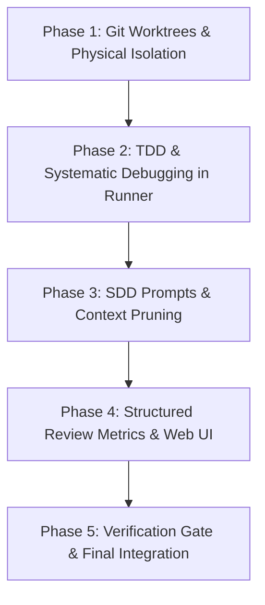

# 🚀 Master Evolution Plan: Agent Cockpit + Superpowers Engineering

> **Objective:** Elevate **Agent Cockpit** to the state-of-the-art in multi-agent orchestration by incorporating deterministic, battle-tested engineering practices from the **Superpowers** framework (`obra/superpowers`), while preserving Cockpit's native differentiators: real-time visual UI, zero-token AST Symbol Dependency Graph, incremental Markdown Vault, and KISS context boundaries.

---

## 🧭 Comparative Overview: Agent Cockpit vs. Superpowers

| Dimension | Current Agent Cockpit | Superpowers (`obra/superpowers`) | Convergence & Enhancement Strategy |
| :--- | :--- | :--- | :--- |
| **Execution Pattern** | 3x3 parallel orchestrator (single batch) via `spec-orchestrator` | *Subagent-Driven Development (SDD)* with strict implementer ⟷ task-reviewer pairing | Combine Cockpit's simultaneous 3x3 fleet with SDD prompt guardrails and isolation templates |
| **Code Isolation** | Logical locks via regex/hashes (`workflow_lock.py`) on main working tree | Isolated *Git Worktrees* per task (`using-git-worktrees`) with safe fallbacks | Managed physical worktrees via MCP tools for clean, collision-free Gauntlet branches |
| **Validation & Testing** | `test_runner.py` distills outputs and eliminates terminal slop | *TDD Iron Law* (Red-Green-Refactor) + *Systematic Debugging* | Enforced state locks: merges only permitted with verifiable prior red failure evidence |
| **Critique & Review** | Harsh Critic with `log_critique_verdict` and 0-10 scorecards | *Receiving/Requesting Code Review* (raw diff analysis, non-performative verification) | Standardize Gauntlet review prompts and display structured severity breakdown on the Web UI |
| **Completion Evidence** | Markdown Handoff generated via `generate_handoff` | *Verification Before Completion* (strict evidence before assertion) | MCP tool `verify_evidence_gate` before granting `DELIVERED` or `gate_ship_approved` status |

---

## 🛠️ 1. Turbocharged Subagent-Driven Development (SDD) in the Orchestrator

### Diagnosis
In Superpowers, each executor subagent receives a surgical context window without the parent session's conversational history, governed by an uncompromising protocol:
1. **Clarify before touching code:** If requirements are ambiguous, pause and clarify before modifying files.
2. **Recursive dispatch prohibited:** Implementers never spawn peer subagents or reviewers (prevents runaway token explosion).
3. **Shameless escalation:** If blocked or out-of-scope, escalate with `BLOCKED` or `NEEDS_CONTEXT` rather than hallucinating workarounds.
4. **Self-review against raw git diff:** Before claiming completion, review own `git diff` for spec fidelity and regressions.

### Implemented Enhancements in Cockpit

#### A. Structured Template Injection in `spec-orchestrator`
- Prompts for Builders and Critics adopt core tenets of `implementer-prompt.md` and `task-reviewer-prompt.md`:
  - **Builder Prompt:** Isolated briefing, strictly locked file boundaries, mandatory self-diff audit, and zero sub-dispatching.
  - **Critic Prompt:** Raw diff inspection (`git diff BASE_SHA..HEAD_SHA`), spec compliance verification, and technical debt classification without relying on Builder assertions.

#### B. Native MCP Tool: `prepare_task_context`
- Packages slice specifications (`spec_md`), impacted symbols from AST graph (`code_graph.py`), and targeted file diffs into a compact JSON payload, eliminating context pollution.

---

## 🧪 2. Enforced TDD & Systematic Debugging Protocols

### Diagnosis
Terminal noise distillation in `server/test_runner.py` eliminates >95% of console slop. However, agents can still claim passing status prematurely if not deterministically tracked through the Red-Green lifecycle.

### Implemented Enhancements in Cockpit

#### A. TDD Iron Law Enforcement in `test_runner.py` & `workflow_lock.py`
- Deterministic TDD state control:
  1. **Mandatory RED Phase:** Builder invokes `run_project_tests(mode="verify_red")`, where at least one test must fail for expected functional reasons. Cockpit records the failure signature.
  2. **GREEN Phase:** Builder writes minimum necessary code and executes `run_project_tests(mode="verify_green")`. All tests must pass (0 failures).
  3. **Deterministic Gate:** Slices cannot transition to `WAITING_REVIEW` without recorded RED $	o$ GREEN progression.

#### B. Systematic Debugging for Rejected Slices
- When a slice is rejected by the Harsh Critic:
  - Cockpit injects the 4-phase systematic debugging framework into the Builder retry prompt:
    1. Comprehensive error message and stack trace analysis.
    2. Isolated, reproducible failure case formulation.
    3. Inspection of recent diffs (`git diff`).
    4. Strict prohibition of random trial-and-error edits.

---

## 🌳 3. Physical Execution Isolation with Git Worktrees

### Diagnosis
Parallel multi-agent execution on a single shared workspace risks file collision, Windows I/O locks, and branch corruption.

### Implemented Enhancements in Cockpit

#### A. Engine: `server/git_worktrees.py`
- Temporary worktree creation under `.worktrees/slice-N` mapped to ephemeral branches `cockpit/slice-N`.
- Automated protections:
  - Automatic verification of `.worktrees/` in `.gitignore`.
  - Sandbox/permission fallback to repository root.
  - Deterministic cleanup (worktree removal and temporary branch pruning post-merge).

#### B. MCP Worktree Management Tools
- `create_slice_worktree(slice_id: str) -> Dict[str, Any]`: Provisions worktree and returns isolated directory.
- `cleanup_slice_worktree(slice_id: str, merge_to_main: bool) -> Dict[str, Any]`: Squash/merges and cleans directory.

---

## 📊 4. Code Review Metrics in State Store & Web Dashboard

### Diagnosis
Structured code review requires clear categorisation by severity (**Critical**, **Important**, **Minor**) to distinguish merge blockers from cosmetic feedback.

### Implemented Enhancements in Cockpit

#### A. `server/state_store.py` Data Model
- Structured breakdown of review findings:
  ```json
  "review_metrics": {
    "critical_count": 0,
    "important_count": 1,
    "minor_count": 2,
    "spec_compliance": "APPROVED",
    "code_quality": "APPROVED_WITH_NOTES",
    "anti_patterns_detected": ["missing_error_handling"],
    "review_duration_sec": 42
  }
  ```

#### B. Web UI Visualization (`web/index.html` & `web/app.js`)
- **Expanded Gauntlet Log:**
  - Severity-coded cards: `[CRITICAL]` (red), `[IMPORTANT]` (orange), `[MINOR]` (cyan).
  - TDD progression badge: `TDD: RED -> GREEN COMPLIANT`.
- **Overview Dashboard:**
  - Real-time KPIs: *Technical Debt Index*, *Average Attempts per Slice*, and *Active Worktrees*.

---

## 🛡️ 5. Verification Before Completion (Anti-Slop Gate)

### Diagnosis
Agents must produce verifiable, fresh evidence of test and build success before any completion claims can be acknowledged.

### Implemented Enhancements in Cockpit
- **MCP Tool `verify_completion_evidence`:**
  - Validates tests were executed within the last 120 seconds in the target repository/worktree.
  - Requires exit code `exit_code == 0` and zero test failures.
  - The **Human Gate** approval button is unlocked only when fresh verification evidence is cryptographically recorded.

---

## 🗺️ Execution Roadmap


