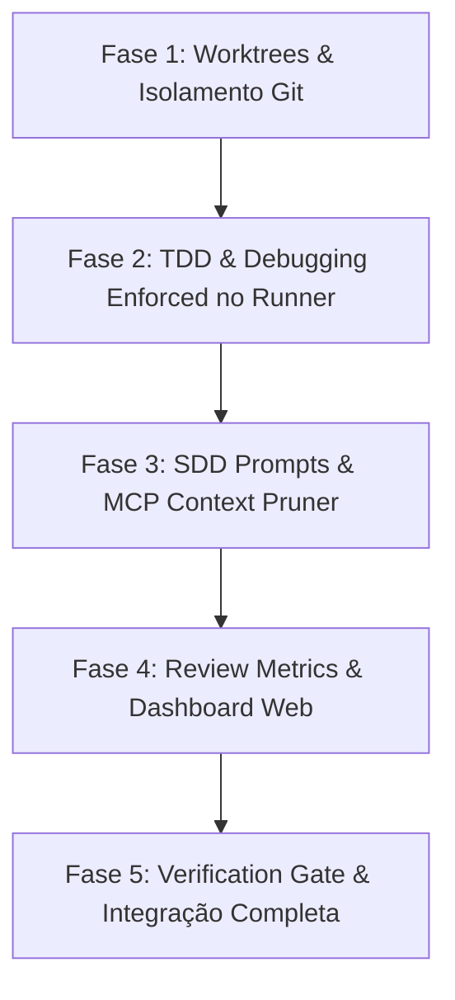

# 🚀 Master Evolution Plan: Agent Cockpit + Superpowers Engineering

> **Objetivo:** Elevar o **Agent Cockpit** ao estado da arte de orquestração multiagente, incorporando as práticas determinísticas, rigorosas e testadas em batalha do repositório **Superpowers** (`obra/superpowers`), sem perder os diferenciais nativos do Cockpit (UI em tempo real, Grafo de Símbolos AST, Vault incremental e limites de contexto KISS).

---

## 🧭 Visão Geral Comparativa: O Que o Cockpit Tem vs. O Que o Superpowers Entrega

| Dimensão | Agent Cockpit Atual | Superpowers (`obra/superpowers`) | Como Integrar / Melhorar no Cockpit |
| :--- | :--- | :--- | :--- |
| **Padrão de Execução** | Orquestrador 3x3 paralelo (lote único) com `spec-orchestrator` | *Subagent-Driven Development (SDD)* com ciclo implementer ⟷ task-reviewer rigoroso | Unir a simultaneidade da frota 3x3 do Cockpit com os templates e guardrails de prompt do SDD |
| **Isolamento de Código** | Lock lógico via regex/hashes (`workflow_lock.py`) na working tree principal | *Git Worktrees* isolados por tarefa (`using-git-worktrees`) com fallback seguro | Worktrees físicos gerenciados via MCP tool para gauntlet branches limpos sem colisões |
| **Validação & Testes** | `test_runner.py` destila saídas e suprime ruído de terminal | *Iron Law do TDD* (Red-Green-Refactor) + *Systematic Debugging* | Lock de workflow ativo: só aceita PR/Merge se existir evidência prévia de teste falhando primeiro |
| **Critique & Revisão** | Harsh Critic com `log_critique_verdict` e scorecard 0-10 | *Receiving/Requesting Code Review* (sem respostas performáticas, análise de diff cru) | Padronizar os prompts de review do Gauntlet e exibir matriz de qualidade por severidade na Web UI |
| **Comprovação de Entrega** | Handoff em Markdown gerado via `generate_handoff` | *Verification Before Completion* (evidência estrita antes de qualquer afirmação) | MCP tool `verify_evidence_gate` antes de permitir status `DELIVERED` ou `gate_ship_approved` |

---

## 🛠️ 1. Subagent-Driven Development (SDD) Turbinado no Orquestrador

### Diagnóstico
No Superpowers, cada subagente executor recebe um contexto cirúrgico, sem o histórico da sessão principal, acompanhado de um protocolo inflexível:
1. **Perguntas antes de começar:** Se houver dúvida de requisitos, para e pergunta antes de tocar em código.
2. **Proibição de sub-despacho recursivo:** O implementador não despacha revisores ou outros subagentes (evita duplicação e explosão de tokens).
3. **Escalação sem vergonha:** Se estiver bloqueado ou fora do escopo previsto, escala com `BLOCKED` ou `NEEDS_CONTEXT` em vez de inventar soluções complexas ou alucinadas.
4. **Self-Review contra o próprio Diff:** Antes de reportar como pronto, lê seu próprio `git diff` avaliando completude e regras violadas.

### Implementações Propostas no Cockpit

#### A. Injeção de Templates Estruturados no `spec-orchestrator`
- Atualizar a skill [`skills/spec-orchestrator/SKILL.md`](file:///c:/Users/f70432d/Documents/GitHub/agent-cockpit/skills/spec-orchestrator/SKILL.md) para gerar os prompts dos 3 Builders e 3 Critics adotando as seções obrigatórias de `implementer-prompt.md` e `task-reviewer-prompt.md`:
  - **Builder Prompt:** Briefing isolado, escopo restrito de arquivos sob lock, ciclo de auto-revisão obrigatória do diff e proibição estrita de auto-despacho.
  - **Critic Prompt:** Leitura exclusiva de diff gerado (`git diff BASE_SHA..HEAD_SHA`), verificação de conformidade de spec (falta algo? sobrou algo desnecessário?), e checklist de dívida técnica sem confiar nas alegações textuais do Builder.

#### B. Nova Tool MCP: `prepare_task_context`
- Localização: [`server/mcp_server.py`](file:///c:/Users/f70432d/Documents/GitHub/agent-cockpit/server/mcp_server.py)
- **Função:** Empacota automaticamente apenas a especificação da fatia (`spec_md`), os símbolos impactados via AST do `code_graph.py` e o diff relevante em um payload JSON leve e padronizado, evitando contaminação de contexto.

---

## 🧪 2. Protocolos TDD e Systematic Debugging Enforced no Runner

### Diagnóstico
O [`server/test_runner.py`](file:///c:/Users/f70432d/Documents/GitHub/agent-cockpit/server/test_runner.py) atual já faz um trabalho excelente de destilação de logs (eliminando 95% do lixo de terminal). No entanto, subagentes ainda podem dizer que testaram ou alterar código de produção antes de provar que criaram o teste unitário/de regressão correspondente.

### Implementações Propostas no Cockpit

#### A. Protocolo "Iron Law TDD" no `test_runner.py` e `workflow_lock.py`
- Adicionar ao `test_runner.py` o controle de estado determinístico do ciclo TDD:
  1. **Fase RED obrigatória:** O builder deve invocar `run_project_tests(mode="verify_red")` onde **pelo menos um teste deve falhar** com erro diretamente relacionado aos critérios da fatia. O Cockpit registra a assinatura da falha no `workflow_state.json`.
  2. **Fase GREEN:** O builder implementa o código mínimo para satisfazer o teste e chama `run_project_tests(mode="verify_green")`. Todos os testes devem passar (0 falhas).
  3. **Validação determinística:** Se o builder tentar marcar a fatia como concluída sem o par comprovado RED $\to$ GREEN, o MCP `update_agent_pulse` rejeita a transição para `WAITING_REVIEW`.

#### B. Integração do Systematic Debugging para Fatias Rejeitadas
- Quando uma fatia for reprovada pelo Harsh Critic ou sofrer quebra inesperada de testes:
  - O Cockpit injeta no próximo prompt do Builder o template de 4 fases do `systematic-debugging`:
    1. Leitura minuciosa da mensagem de erro e stack trace (sem pular linhas cruciais).
    2. Reprodução isolada e determinística do caso de falha.
    3. Inspeção de diffs recentes (`git diff`).
    4. Proibição explícita de "tentativas aleatórias de correção" (guess-and-check).

---

## 🌳 3. Isolamento Físico de Execução com Git Worktrees

### Diagnóstico
Atualmente, se 3 subagentes tentarem alterar arquivos simultaneamente ou rodar compilações/testes em paralelo na mesma pasta física, colisões de escrita, bloqueios de I/O no Windows e conflitos na branch principal podem ocorrer.

### Implementações Propostas no Cockpit

#### A. Novo Módulo: `server/git_worktrees.py`
- Implementação inspirada em `skills/using-git-worktrees/SKILL.md`:
  - Criação de worktrees temporárias sob `.worktrees/slice-N` vinculadas a branches efêmeras `cockpit/slice-N`.
  - Salvaguardas automáticas:
    - Verificação de que `.worktrees/` está no `.gitignore` (já ajustado).
    - Detecção de restrições de sandbox ou falhas de permissão com fallback transparente para a pasta raiz.
    - Limpeza determinística ao final do épico (remove worktrees e deleta branches temporárias após merge/rebase).

#### B. Ferramentas MCP para Suporte a Worktrees
- Adicionar ao `mcp_server.py`:
  - `create_slice_worktree(slice_id: str) -> Dict[str, Any]` (cria a worktree e retorna o path isolado).
  - `cleanup_slice_worktree(slice_id: str, merge_to_main: bool) -> Dict[str, Any]` (faz squash/merge e limpa a pasta).
- Dessa forma, o Gauntlet Loop pode ser executado em um ambiente 100% isolado por fatia vertical.

---

## 📊 4. Enriquecimento do State Store & Dashboard Web com Métricas de Code Review

### Diagnóstico
O Superpowers possui um checklist de excelência nas skills `receiving-code-review` e `requesting-code-review`. Ele divide os achados em severidades (**Critical**, **Important**, **Minor**) e impede feedbacks genéricos e performáticos.

### Implementações Propostas no Cockpit

#### A. Atualização do `server/state_store.py`
- Adicionar ao modelo de dados do Gauntlet e das Slices um breakdown estruturado de achados:
  ```json
  "review_metrics": {
    "critical_count": 0,
    "important_count": 1,
    "minor_count": 2,
    "spec_compliance": "APPROVED",
    "code_quality": "APPROVED_WITH_NOTES",
    "anti_patterns_detected": ["missing_error_handling"],
    "review_duration_sec": 42
  }
  ```

#### B. Exibição na Interface Web (`web/index.html` e `web/app.js`)
- **Aba "Gauntlet Log" expandida:**
  - Cards de feedback com badges estilizados por severidade: `[CRITICAL]` (vermelho), `[IMPORTANT]` (laranja), `[MINOR]` (azul).
  - Tabela comparativa de pontuação de qualidade por fatia.
  - Indicador visual de conformidade de TDD (Badge `TDD: RED -> GREEN COMPLIANT`).
- **Aba "Visão Geral":**
  - Novos KPIs no grid principal: *Índice de Dívida Técnica*, *Média de Tentativas por Fatia* e *Status de Worktrees Ativas*.

---

## 🛡️ 5. Ferramenta "Verification Before Completion" (Anti-Slop Gate)

### Diagnóstico
O Superpowers estabelece a regra de ferro: **"No completion claims without fresh verification evidence"**. Subagentes frequentemente tentam assumir que *"está funcionando"* sem executar a verificação completa ou após uma execução parcial desatualizada.

### Implementações Propostas no Cockpit
- **MCP Tool `verify_completion_evidence`:**
  - Valida se os testes rodaram há menos de 120 segundos no repositório/worktree alvo.
  - Garante código de saída `exit_code == 0` e contagem de erros zerada.
  - O botão de liberação do **Human Gate** (`btn-human-gate` na topbar) só é habilitado para aprovação se a ferramenta certificar evidência fresca e íntegra de build e testes.

---

## 🗺️ Matriz de Priorização e Plano de Ação



1. **Fase 1: Git Worktrees (`server/git_worktrees.py` + MCP tools)**:
   - Permite que múltiplos agentes trabalhem sem quebrar o código do outro na mesma branch.
2. **Fase 2: TDD Enforced (`server/test_runner.py` & `workflow_lock.py`)**:
   - Força o ciclo Red-Green comprovado por logs antes de aceitar qualquer implementação.
3. **Fase 3: Calibração dos Prompts da Skill (`spec-orchestrator` & `gauntlet-loop`)**:
   - Injeta os papéis estritos de `implementer` e `task-reviewer` com foco exclusivo em diffs e especificação.
4. **Fase 4: Métricas e Web Dashboard (`state_store.py`, `web/index.html`, `web/app.js`)**:
   - Exibe a granularidade dos achados (Critical, Important, Minor) em tempo real.
5. **Fase 5: Anti-Slop Completion Gate**:
   - Trava o fechamento do Épico e a assinatura do Handoff caso não haja evidência fresca de verificação.
